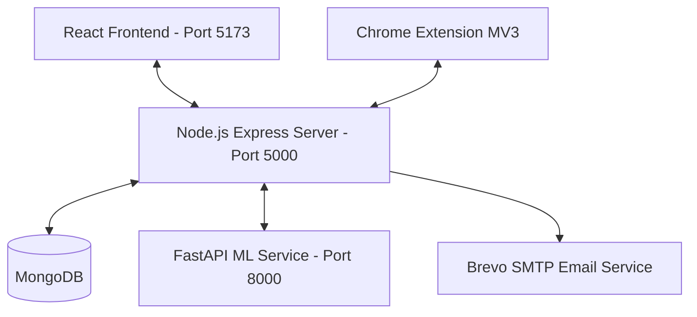
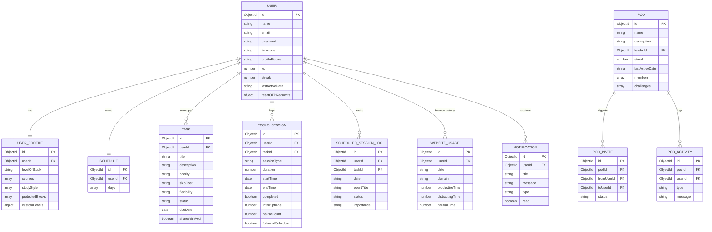

# FocusFlow: Complete System Architecture, Features & User Manual

Welcome to the comprehensive system documentation for **FocusFlow**—an intelligent, student-centric study productivity platform that combines rule-based scheduling, machine learning analytics, a Chrome extension companion, and social accountability circles.

This document covers everything about FocusFlow: the technical architecture, data entities, chronological development, features breakdown, and a complete user interface manual.

---

## 1. System Overview & Architecture

FocusFlow is built as a split-service system consisting of three core parts:
1. **Node.js/Express API Backend**: Operates on port `5000`. Acts as the central database gateway, auth router, scheduler controller, and social pods coordinator. Connected to a **MongoDB** database.
2. **React/Vite Frontend Client**: Operates on port `5173/5174`. Provides a highly responsive, sky blue/teal brand-themed, glassmorphic UI.
3. **FastAPI Machine Learning Service**: Operates on port `8000`. Uses `scikit-learn` to process behavioral data, calculate study completion probabilities, assess burnout risks, and generate personalized coach tips.
4. **Chrome Companion Extension**: Manifest V3 extension that hooks into Chrome's active tab API to monitor domain usage, enforce site blocks, and log focus session data.

### System Diagram

---

## 2. Complete Entity-Relationship (ER) Data Model

The following entity diagram displays the Mongoose collections and relations under the hood in FocusFlow:

---

## 3. Chronological Project Evolution

FocusFlow evolved iteratively across 19 sequential phases:

### Phase 1: User Onboarding Flow
- **Models**: Created `UserProfile.js` mapping student characteristics (study style, courses, target hours).
- **Frontend**: Created `/onboarding` page—a 5-step interactive onboarding wizard containing slider configurations and profile setup.
- **Controls**: Mounted route protection filters to redirect students to onboarding if their profile is incomplete.

### Phase 2: Generating Week-1 Baseline Schedules
- **Algorithm**: Implemented a rule-based scheduler that dynamically maps 24-hour schedules around class timings, sleep, travel buffers, rest breaks, and study slots.
- **Frontend**: Built `Schedule.jsx` rendering study events in an interactive weekly calendar timeline.

### Phase 3: Collecting Behavioral Data
- **Telemetry**: Extended `FocusSession.js` database schema to track study session feedback, distraction button counts, and timer pauses.
- **Modal**: Created `PostSessionModal` overlay asking for self-reported difficulty ratings upon timer completion.

### Phase 4 & 5: Productivity Coach & Recommendation Engines
- **Diagnostics**: Coded analytics rules calculating the user's actual focus peak hour (Morning, Afternoon, Evening, Night) and optimal focus duration.
- **Tips**: Formulated advice rules warning students when distraction limits are breached or when study sessions should be shortened.

### Phase 7: Machine Learning Server Integration
- **Server**: Established Python FastAPI microservice (`ml-service/main.py`) training a Random Forest Classifier & Regressor.
- **Integration**: Connected backend to fetch real-time predictions of completion probabilities and burnout risks, rendering them inside `Analytics.jsx`.

### Phase 8: Chrome Extension Companion
- **Client**: Drafted Manifest V3 Chrome Extension containing popup controls (`popup.html`/`popup.js`) and background logs listener (`background.js`).
- **Sync**: Enabled sync of active login tokens, select options, and focus timers from web dashboard to browser extension.

### Phase 9: Sky Blue/Teal Theme Redesign
- **Aesthetics**: Overhauled global CSS variables inside `index.css` adopting a modern sky blue and teal productivity palette (inspired by RescueTime and Clockify).
- **Polish**: Standardized header inputs, sidebar layouts, and modal panels to support light/dark modes dynamically.

### Phase 10: Web Usage Focus Score
- **Models**: Created `WebsiteUsage.js` collection database logs.
- **Classification**: Categorized key domains (Productive: `github.com`, `leetcode.com`; Distracting: `youtube.com`, `instagram.com`).
- **Telemetry**: Configured Chrome Extension to log active tab domains and sync usage time every 30s. Created Focus Score metric.

### Phase 11: Multi-Granularity Web Aggregators & Missed Session Alerts
- **Models**: Created `WeeklyWebsiteUsage.js` and `MonthlyWebsiteUsage.js` collections.
- **Cron Alert**: Created scheduler checker generating missed session notifications if scheduled slots end without matching focus session logs.
- **ML Tip**: Hooked web spend ratio parameters to ML service to print weekly distraction warning tips in the user header.

### Phase 12 & 13: OTP Password Reset & Extension Promoters
- **Auth**: Coded secure 6-digit numeric OTP reset workflow.
- **Promoters**: Created entrance and exit animations for a recurring glassmorphic Sidebar Toast prompting extension downloads every 2 minutes.

### Phase 14 & 15: Custom Onboarding Extensions
- **Exceptions**: Appended custom timing/class exceptions textboxes inside Profile Settings saving custom scheduling rules.
- **Edit Route**: Fixed student onboarding redirect loops when clicking "Edit Student Profile" in the header.

### Phase 16: Base64 Profile Picture Uploads
- **Model**: Added `profilePicture` field in `User` model.
- **Settings**: Enabled file uploads (under 2MB) converting pictures to base64 Data URLs and displaying them in headers, sidebars, and pod lists.

### Phase 17: SMTP Mail Service & Rate Limits
- **SMTP**: Integrated Nodemailer mailer transporter connecting to external SMTP relays (like Brevo).
- **Limit**: Enforced strict security checks allowing a maximum of 2 password reset OTP requests per calendar day.

### Phase 18: Adaptive Schedule Recovery & Protected Lifestyle Blocks
- **Task Priority**: Added priority levels (Critical, High, Medium, Low), skip cost, and flexibility constraints to Tasks.
- **Lifestyle Blocks**: Supported scheduling study sessions around locked personal activities (Gym, Gaming, etc.).
- **Missed Session Modal**: Formulated non-judgmental missed study slot confirmation dialog.
- **Rearrangement Engine**: Rebuilt schedule layouts when a missed session is marked as **Critical**, shifting study tasks into free windows while protecting sleep and leisure blocks.

### Phase 19: Social Pods
- **Mechanics**: Formed accountability groups (maximum 4 students) sharing leaderboard scores, group streaks, quest challenge progress bars, and timeline feeds.
- **Nudges**: Made quick action nudges (Clap 👏, Encourage 💪, Poke 👉) prompting real-time in-app notifications.

---

## 4. Feature Under-the-Hood Mechanics

### 4.1 Missed Session Detection & Recovery
Every time the user visits the dashboard or notifications are loaded, the system triggers the missed session checker:
1. It compares scheduled study events for the day that have already ended against completed focus sessions logged.
2. If no focus session starts within `+/- 30 minutes` of the scheduled event, the system creates a `ScheduledSessionLog` with status `"Missed Session"`.
3. A non-judgmental **Missed Session Modal** overlays the dashboard, asking the student how important this session was (Critical, Important, Optional, or Cancel).
4. If **Critical** is selected, the backend runs the **Rearrangement Engine**:
   - Gathers remaining flexible hour slots for the day.
   - Preserves all locked events: sleep, class timings, and protected blocks (e.g. Gym 18:00 - 19:00).
   - Packs remaining study blocks back in, inserting 15-minute rest breaks.
   - Updates the database schedule, notifying the user.

### 4.2 Web usage Tracking & Focus Score
1. The companion extension background script tracks active window domains.
2. Every 30 seconds, it sends a payload package `POST /api/website-usage/log` containing domains and seconds spent.
3. The server checks the domains against category filters:
   - **Productive**: `leetcode.com`, `stackoverflow.com`, `github.com`, `localhost`, etc.
   - **Distracting**: `youtube.com`, `instagram.com`, `facebook.com`, `reddit.com`, `netflix.com`, etc.
   - **Neutral**: `notion.so`, `docs.google.com`, email services, etc.
4. It aggregates this data at the **Daily**, **Weekly**, and **Monthly** levels.
5. **Focus Score** is calculated as:
   $$\text{Focus Score} = \left( \frac{\text{Productive Time}}{\text{Productive Time} + \text{Distracting Time}} \right) \times 100$$
   (Neutral browsing time is excluded from the ratio).

### 4.3 Social Pods Accountability loop
- **Streak Calculation**: The pod checks if all members have logged at least one focus session today. If they have, and the pod's `lastActiveDate` was yesterday, the group streak increments. If a day is missed, it resets.
- **Quest Challenges**: Collaborative goals where members pool XP. Every completed focus session logs points (+10 XP) to the map of the challenge. Once the sum reaches `targetXP`, the challenge status is toggled to `"completed"`.
- **Nudge Engine**: Allows students to send notifications of type `pod`. This maps to three predefined template messages that render immediately inside the recipient's notification bell.

---

## 5. Exhaustive Frontend User Interface Manual

Here is the step-by-step user manual describing every page and option shown on the frontend.

### 5.1 Main Sidebar Navigation
The left sidebar controls app routing. Icons display:
- **Dashboard**: Core summary and browser analytics.
- **Tasks**: Personal task manager database.
- **Focus Session**: Pomodoro timer workspace.
- **Analytics**: Deep statistical review and ML coach cards.
- **Schedule**: Weekly calendar timeline and adaptive recommendations.
- **Social Pods**: Group accountability center.
- **Extension**: Shortcut link to Chrome extension configurations.
- **Settings**: App preferences, profile pictures, and custom onboarding variables.

---

### 5.2 The Dashboard
Your landing page containing daily telemetry summaries:
- **Daily Stat Cards**:
  - *Focus Hours Today*: Sum of completed focus sessions today.
  - *Completed Sessions*: Count of completed Pomodoros.
  - *Current Focus Streak*: Consecutive days study goal met.
  - *Web Focus Score*: Gauge chart indicating productivity ratio.
- **Today's Web Activity Bar**: A horizontal segment bar colored by category (Teal for Productive, Grey for Neutral, Rose for Distracting) detailing active browsing.
- **Top Visited Sites**: List of top domains accessed today with duration spent.
- **Promo Banner**: A slide-in bottom toast prompting students to download the zip extension if they haven't synced it yet.

---

### 5.3 Task Manager (`/tasks`)
A grid displaying your academic database.
- **Filter Controls**:
  - *Status Filter*: Filter by All, Pending, In Progress, Completed.
  - *Priority Filter*: Filter by All, High, Medium, Low.
  - *Search Box*: Real-time search of task titles.
- **Task Form Fields (`+ Create Task`)**:
  - **Task Title**: Text summary of the homework or assignment.
  - **Description**: Detailed notes.
  - **Priority**: *Critical* (glowing purple), *High* (red), *Medium* (amber), *Low* (green).
  - **Skip Cost**: Penalty consequence if task is skipped (High, Medium, Low).
  - **Flexibility**: Fixed (cannot shift), SemiFlexible, Flexible (free to shift in scheduler).
  - **Due Date**: Calendar deadline picker.
  - **Share with Pod**: Checkbox toggle. If checked, details (like task title) are visible to your pod. If unchecked, details are replaced with "Private Task completed" in the social feed.

---

### 5.4 Focus Timer Workspace (`/focus`)
The Pomodoro timer screen.
- **Timer Modes**: Choose between *Focus (25m)*, *Short Break (5m)*, and *Long Break (15m)*.
- **Task Dropdown**: Select which task from your database you are currently studying.
- **Timer Control Ring**:
  - Ring color adapts to the mode (Focus: Sky Blue, Breaks: Teal/Dark Sky Blue).
  - Large **Start / Pause / Reset** control buttons.
- **Telemetry Buttons**:
  - **+1 Distraction**: A quick tap counter button to track how many times you got off track during the timer session.
- **Post-Session Feedback Modal**:
  - Overlays the page when the timer completes.
  - *Followed Schedule*: Checkbox verifying if you stuck to your scheduled block.
  - *Difficulty Rating*: 5-star slider selector.
  - *Feedback Description*: Input field to note study difficulties (e.g. "Math section had complex formulas").

---

### 5.5 Analytics Page (`/analytics`)
Detailed analytics summaries generated by the FastAPI ML service:
- **ML Predictive Panel**:
  - *Study Completion Probability*: Score gauge showing likelihood of completing planned tasks based on historical sessions.
  - *Burnout Risk*: Heat scale indicator warning you when schedule volume exceeds sustainable limits.
  - *Best Predicted Slots*: Recommended hours to study based on times you logged high focus scores.
- **Productivity Density Heatmap**: Git-like grid committing green blocks representing focus volume across calendar days.
- **AI Coach Cards**: Recommendation lists generating custom tips (e.g. "You spent more time on distracting sites this week. Try locking down those domains!").

---

### 5.6 Interactive Schedule Page (`/schedule`)
Your calendar management interface:
- **Weekly Schedule Timeline**: Multi-layered hourly grid displaying events colored by type:
  - *Sleep* (Black)
  - *Lectures / Class* (Sky Blue)
  - *Coaching* (Purple)
  - *Study Blocks* (Teal)
  - *Protected Leisure* (Orange)
  - *Rest Breaks* (Green)
- **Regenerate Button**: Calls rule-based scheduler to rebuild baseline schedules.
- **Adaptive Suggestions Panel**: Prompts tips when skip rates exceed limits (e.g. "You've skipped 'Morning Calculus' 3 times. Shift to 14:00?").
- **Missed Session Modal Dialog**:
  - Prompts you with: *"You missed [Session Name] today. Let's make it up!"*
  - Select: **Critical** (Rearranges remaining day events), **Important** (Postpones to tomorrow), **Optional** (Skips task), or **Cancel** (Deletes session).

---

### 5.7 Social Pods (`/pods`)
The social accountability hub:
- **Pending Invites Banner**: A sticky alert strip appearing at the top of the viewport when friend invites exist, offering quick *Accept* / *Decline* buttons.
- **Pod Selector tabs**: Swap views between different pods you are in.
- **Overview Card**: Displays pod name, descriptions, and the leader name.
- **Streak Flame Indicator**: Displays the current Group Streak (e.g. `🔥 5 days`).
- **Group Quests**:
  - Lists collaborative challenges.
  - Progress bar showing contributed XP vs Target XP.
  - *Start Challenge button*: Prompts a form to input title, target XP, and end date.
- **Social Feed Timeline**: Real-time updates showing friend achievements, nudges, and join logs.
- **Pod Leaderboard Sidebar**:
  - Ranks members by weekly XP.
  - Shows names, custom uploaded profile avatars, and individual streaks.
  - **Nudge Button Panel**: Quick emoji nudge triggers (Clap 👏, Encourage 💪, Poke 👉) which generate real-time notification alerts for your friends.
- **Invite Friends Button**: Opens a popup modal containing a search field. Enter names or emails to query profiles and send invites.

---

### 5.8 Settings Page (`/settings`)
App profile and configurations workspace:
- **Profile Tab**:
  - **Profile Avatar**: Upload custom pictures (JPEG, PNG under 2MB). Conversions, cropping, and updates occur instantly via base64 strings.
  - **Profile Info**: Update name, email, timezone, and appearance themes (Light vs Dark mode).
  - **Extra Custom Details**: Input boxes to declare timing, style, or academic class exceptions (e.g. "Preparing for GRE Exam in July"). Used by the rule-based scheduler to customize study slots.
- **Protected Leisure Tab**:
  - **Lifestyle Blocks Manager**: Declare locked, recurring activities you do not want study sessions scheduled during (e.g. "Gaming" repeating daily at 18:00 - 19:00).
- **Extension Tab**:
  - Contains step-by-step instructions on downloading the zip companion, unpacking it in Chrome Developer Mode, and syncing your JWT token.
