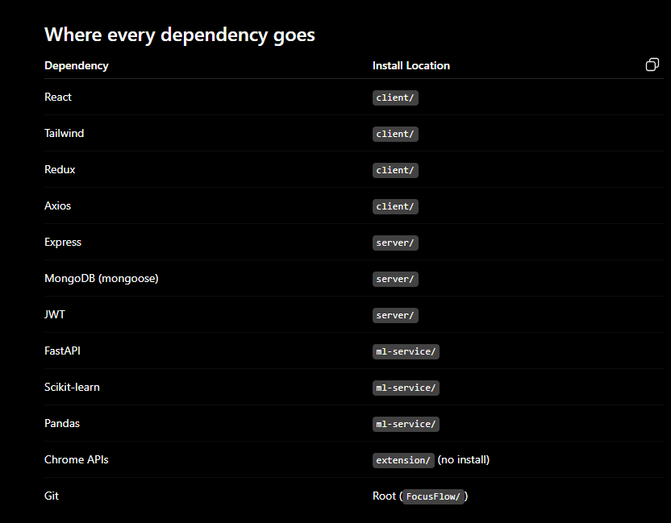

# FocusFlow
Most productivity tools only track time. They do not analyze work patterns and generate personalized schedules to improve focus and goal completion. The proposed system monitors screen activity, identifies productivity trends, and recommends optimized work timelines.

FocusFlow/
│
├── client/        ← React + Tailwind
├── server/        ← Node + Express
├── ml-service/    ← Python + FastAPI + ML
├── extension/     ← Chrome Extension
└── docs/

npm install
npm install react-router-dom axios
npm install @reduxjs/toolkit react-redux
npm install react-query *****
npm install react-icons
npm install recharts
tailwind

npm install express mongoose cors dotenv bcryptjs jsonwebtoken
npm install express-validator
npm install node-cron
nodemon

pip install fastapi
pip install uvicorn
pip install pandas
pip install numpy
pip install scikit-learn
pip install matplotlib
pip install joblib

Start order during development

Run three terminals:

Terminal 1

cd client
npm run dev

Terminal 2

cd server
npm run dev

Terminal 3

cd ml-service
venv\Scripts\activate
uvicorn main:app --reload

That's the professional setup I'd use for FocusFlow from day one. The very first coding milestone should be:

React Login/Register UI → Express Auth API → MongoDB User Collection → JWT Login working end-to-end.