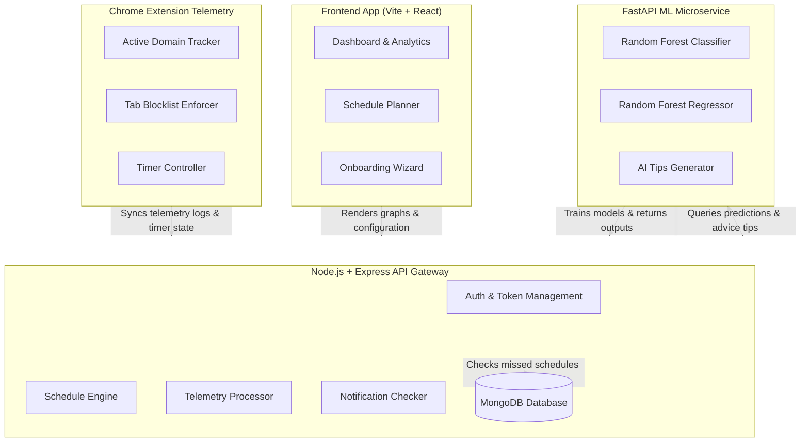

# FocusFlow 🎯 — Intelligent Study Schedule & Focus Telemetry System

FocusFlow is a comprehensive, machine-learning-driven study planner and behavioral tracking system. Unlike generic blockers or manual timers, FocusFlow bridges the gap between schedule planning and actual behavioral enforcement through a Chrome Extension telemetry layer, a responsive React web dashboard, and a scikit-learn random forest predictive model.

---

## 🏗️ System Architecture

FocusFlow consists of four core components working in unison to track, analyze, and enforce productivity:



---

## ⚡ How FocusFlow is Different

Most productivity tools only track time or act as static blocker extensions. FocusFlow is designed specifically as an academic companion:

| Feature | RescueTime / Clockify | Cold Blockers | FocusFlow 🎯 |
| :--- | :--- | :--- | :--- |
| **Telemetry Tracking** | Tracks time without target goals | Blocks sites without analyzing habits | Tracks domains and aligns them directly to scheduled study slots |
| **Personalization** | Generic charts | Strict block lists | Generates custom baseline schedules matching class & sleep patterns |
| **Machine Learning** | ❌ None | ❌ None | ✅ Predicts completion probability and burnout risk using Random Forest models |
| **Enforcement** | ❌ None | ✅ Simple URL redirect | ✅ Automatically redirects distraction domains *only* during active sessions |
| **Dynamic Coaching** | ❌ None | ❌ None | ✅ Generates real-time study slot suggestions and tips based on weekly browse history |

---

## 📂 Project Structure

```
FocusFlow/
├── client/                     # React + Vite frontend SPA
│   ├── src/
│   │   ├── components/
│   │   │   ├── auth/           # Login, Register, Theme-aware Layouts
│   │   │   ├── layout/         # Sidebar, Searchable Navigation Bar
│   │   │   └── tasks/          # Task Lists, priority selectors, and forms
│   │   ├── pages/
│   │   │   ├── Dashboard.jsx   # Focus Score, Today's Web Activity, Streak
│   │   │   ├── FocusSession.jsx# Timer panel, live distraction counters, ratings
│   │   │   ├── Analytics.jsx   # ML Predictive values, heatmaps, AI Coach
│   │   │   ├── Schedule.jsx    # Weekly timetable timeline & tabs
│   │   │   ├── Onboarding.jsx  # Student academic onboarding wizard
│   │   │   └── Settings.jsx    # Appearance theme, timezone settings, extension downloader
│   │   └── services/           # Axios API Client service layers
├── server/                     # Express.js REST API backend
│   ├── config/                 # DB connections
│   ├── controllers/            # Logic for auth, profile, schedules, and usage
│   ├── middleware/             # Express JWT protect routers
│   ├── models/                 # Mongoose database models:
│   │   │                       # (User, UserProfile, Schedule, FocusSession,
│   │   │                       # Notification, WebsiteUsage, WeeklyWebsiteUsage, MonthlyWebsiteUsage)
│   │   └── routes/             # Routed Express API endpoints
├── ml-service/                 # Python FastAPI + scikit-learn microservice
│   ├── main.py                 # FastAPI endpoints & Random Forest classifier/regressor
│   └── notebooks/              # For exploratory analysis & prototyping
└── extension/                  # Manifest V3 Chrome Extension
    ├── manifest.json           # Declarations (idle, tabs, alarms, storage)
    ├── background.js           # Domain usage accumulator, idle monitor, enforcer
    ├── popup.html/js           # Extension login and session controller popup
    └── block.html              # Custom redirection page when visiting blocklists
```

---

## 🚀 Installation & Running Locally

### Prerequisites
* **Node.js** (v18+)
* **MongoDB** (Running locally on `mongodb://localhost:27017/focusflow`)
* **Python** (3.8+ with virtualenv)
* **Google Chrome** browser

### Step 1: Start the Backend server
```bash
cd server
npm install
npm run dev
```
*App is configured to run at `http://localhost:5000`.*

### Step 2: Start the FastAPI ML Service
```bash
cd ml-service
python -m venv venv
venv\Scripts\activate       # On Linux/macOS: source venv/bin/activate
pip install -r requirements.txt
python main.py
```
*Inferences are served at `http://localhost:8000`.*

### Step 3: Start the Client Web App
```bash
cd client
npm install
npm run dev
```
*Frontend runs at `http://localhost:5173` (or `5174`).*

### Step 4: Install the Chrome Extension
1. Open Google Chrome and go to `chrome://extensions/`.
2. Turn on **Developer mode** (top right toggle).
3. Click **Load unpacked** (top left button).
4. Select the `extension/` folder inside this repository.

---

## 🛠️ Key Features Walkthrough

### 1. 5-Step Student Onboarding & Calendar Generator
Upon registration, users configure their student profile (Academic level, Sleep window, Class/lecture times, and Commute buffers). The server calculates a baseline week-1 schedule dynamically, inserting rest periods and study blocks matched to their goals and peak focus periods.

### 2. Chrome Extension Telemetry & Synced Blocker
The extension hooks into Chrome tab switches and system idle listeners to log active browser time. 
* Visited domains are batched and synced to the backend every 30 seconds.
* Categorization is determined on the server:
  * **Productive:** Coding platforms, local development (`localhost`), documentation sites, and MOOCs.
  * **Distracting:** Social media, stream platforms, and gaming portals.
  * **Neutral:** Emails, Notion, and Google Drive.
* If a focus session starts on the web dashboard, the extension automatically redirects distractors to a custom `block.html` page and counts interruptions.

### 3. Multi-Granularity Spends & ML Coach
Your web activity is saved on daily, weekly, and monthly levels. The FastAPI service analyzes these spends:
* Adjusts completion probability and burnout risks based on distraction rates.
* Generates actionable suggestions in the recommendations panel (e.g. suggesting shifting slots, shortening durations, or locking down blocklists).

### 4. Dynamic Notification Center
Whenever a scheduled study block ends, the system checks whether you started a matching focus timer. If you missed the slot, it posts an alert (`⚠️ Missed Session`) directly in the Navbar notifications dropdown. It also appends daily productivity tips (`💡 AI Focus Flow Recommendation`) generated by the ML model.

---

## 🔮 Future Scope

* **Federated Learning:** Refactor model updates to train predictions locally on the user's browser extension sandbox, maximizing browser history privacy.
* **Integrations:** Add bi-directional syncs for Google Calendar, Outlook, and Apple Calendar events.
* **Gamification & Study Rooms:** Peer-to-peer visual dashboards and group study rooms utilizing socket.io to encourage accountability.
* **Cross-Browser Support:** Target Firefox (WebExtensions API) and Safari (App Extensions) for native cross-device tracking.