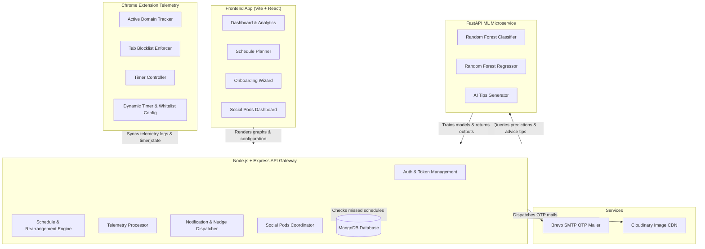

# FocusFlow 🎯 — Intelligent Study Schedule & Focus Telemetry System

FocusFlow is a comprehensive, machine-learning-driven study planner, behavioral tracking system, and social accountability platform. Unlike generic blockers or manual timers, FocusFlow bridges the gap between schedule planning and actual behavioral enforcement through a Chrome Extension telemetry layer, a responsive React web dashboard, a scikit-learn random forest predictive model, and peer-to-peer social accountability pods.

## 🌐 Live Production Deployment
* **FocusFlow Web Application**: [https://focus-flow-flame-five.vercel.app](https://focus-flow-flame-five.vercel.app)

---

## 🏗️ System Architecture

FocusFlow consists of five core components working in unison to track, analyze, and enforce productivity:



---

## ⚡ How FocusFlow is Different

Most productivity tools only track time or act as static blocker extensions. FocusFlow is designed specifically as an academic companion:

| Feature | RescueTime / Clockify | Cold Blockers | FocusFlow 🎯 |
| :--- | :--- | :--- | :--- |
| **Telemetry Tracking** | Tracks time without target goals | Blocks sites without analyzing habits | Tracks domains and aligns them directly to scheduled study slots |
| **Personalization** | Generic charts | Strict block lists | Generates custom baseline schedules matching class & sleep patterns |
| **Machine Learning** | ❌ None | ❌ None | ✅ Predicts completion probability and burnout risk using Random Forest models |
| **Adaptive Recovery** | ❌ None | ❌ None | ✅ Automatically reschedules missed critical blocks around lifestyle hours |
| **Social Pods** | ❌ None | ❌ None | ✅ Mutual accountability loops with streaks, collective quests, and nudges |
| **Cloudinary Integration**| ❌ None | ❌ None | ✅ Lightweight base64 to CDN profile picture pipelines |
| **Enforcement** | ❌ None | ✅ Simple URL redirect | ✅ Automatically redirects distraction domains *only* during active sessions |

---

## 📂 Project Structure

```
FocusFlow/
├── client/                     # React + Vite frontend SPA
│   ├── src/
│   │   ├── components/
│   │   │   ├── auth/           # Login, Register, Theme-aware Layouts
│   │   │   ├── layout/         # Sidebar, Searchable Navigation Bar
│   │   │   └── tasks/          # Task Lists, priority selectors, and forms
│   │   ├── pages/
│   │   │   ├── Dashboard.jsx   # Focus Score, Today's Web Activity, Streak
│   │   │   ├── FocusSession.jsx# Timer panel, live distraction counters, ratings
│   │   │   ├── Analytics.jsx   # ML Predictive values, heatmaps, AI Coach
│   │   │   ├── Schedule.jsx    # Weekly timetable timeline & tabs
│   │   │   ├── Onboarding.jsx  # Student academic onboarding wizard
│   │   │   ├── Pods.jsx        # Group leaderboards, feeds, quests, nudges
│   │   │   └── Settings.jsx    # Appearance theme, custom details, profile pictures
│   │   └── services/           # Axios API Client service layers
├── server/                     # Express.js REST API backend
│   ├── config/                 # DB connections
│   ├── controllers/            # Logic for auth, profile, schedules, and usage
│   ├── middleware/             # Express JWT protect routers
│   ├── models/                 # Mongoose database models:
│   │   │                       # (User, UserProfile, Schedule, FocusSession, Task,
│   │   │                       # Notification, WebsiteUsage, Pod, PodInvite, PodActivity)
│   │   └── routes/             # Routed Express API endpoints
├── ml-service/                 # Python FastAPI + scikit-learn microservice
│   ├── main.py                 # FastAPI endpoints & Random Forest classifier/regressor
└── extension/                  # Manifest V3 Chrome Extension
    ├── manifest.json           # Declarations (idle, tabs, alarms, storage)
    ├── background.js           # Domain usage accumulator, whitelist filter, enforcer
    ├── popup.html/js           # Extension login, dynamic timer and whitelist configurator
    └── block.html              # Custom redirection page when visiting blocklists
```

---

## 🚀 Installation & Running Locally

### Prerequisites
* **Node.js** (v18+)
* **MongoDB** (Running locally on `mongodb://127.0.0.1:27017/focusflow`)
* **Python** (3.8+ with virtualenv)
* **Cloudinary Account** (for profile picture hosting)
* **Brevo Account** (for SMTP OTP mailing services)
* **Google Chrome** browser

### Step 1: Configure Backend Environment
Create a `.env` file in the `server` directory and add your credentials:
```env
PORT=5000
MONGO_URI=mongodb://127.0.0.1:27017/focusflow
JWT_SECRET=your_jwt_secret_key

# SMTP Configuration
SMTP_HOST=smtp-relay.brevo.com
SMTP_PORT=587
SMTP_USER=your_brevo_username
SMTP_PASS=your_brevo_smtp_password
EMAIL_FROM="FocusFlow <your_verified_sender_email>"

# Cloudinary Configuration
CLOUDINARY_CLOUD_NAME=your_cloudinary_cloud_name
CLOUDINARY_API_KEY=your_cloudinary_api_key
CLOUDINARY_API_SECRET=your_cloudinary_api_secret
```

### Step 2: Start the Backend server
```bash
cd server
npm install
npm run dev
```
*App is configured to run at `http://localhost:5000`.*

### Step 3: Start the FastAPI ML Service
```bash
cd ml-service
python -m venv venv
venv\Scripts\activate       # On Linux/macOS: source venv/bin/activate
pip install -r requirements.txt
python main.py
```
*Inferences are served at `http://localhost:8000`.*

### Step 4: Start the Client Web App
```bash
cd client
npm install
npm run dev
```
*Frontend runs at `http://localhost:5173`.*

### Step 5: Install the Chrome Extension
1. Open Google Chrome and go to `chrome://extensions/`.
2. Turn on **Developer mode** (top right toggle).
3. Click **Load unpacked** (top left button) and select the `extension/` folder in this repo, or download it directly from the web app's header.

---

## 🛠️ Key Features Walkthrough

### 1. 5-Step Academic Onboarding & Baseline Scheduler
Upon registration, users configure their academic profiles (Study style, class schedules, target study hours). The server calculates a baseline week-1 schedule dynamically, arranging study blocks around class timings, sleep schedules, and travel buffers.

### 2. Chrome Extension with Custom Whitelists & Timers
The extension tracks active browser domain timings and syncs logs to the backend. It includes:
* **Custom Timers**: Set Focus, Short Break, and Long Break times directly in the extension.
* **Custom Whitelist/Blocklist**: Configure which domains to block during active study sessions, and whitelists (like `google.com`) that should never be blocked.

### 3. Adaptive Recovery Engine & Protected Lifestyle Blocks
If you miss a scheduled session:
* The system displays a non-judgmental **Missed Session Modal** asking for task importance.
* Marking it **Critical** runs the **Rearrangement Engine**, which automatically reschedules the study block into your upcoming free hours while strictly protecting your sleep and predefined lifestyle blocks (e.g. Gym, gaming).

### 4. Social Pods (Accountability Groups)
Connect with friends in small group accountability circles to study and level up together:
* **Unique Username System**: Compulsory handle registration (`@username`) displaying handles on the sidebar, header dropdowns, and allowing quick friend searches.
* **Real-Time Presence Tracking**: Green status indicator pulses and live study task labels next to users' names on the pod leaderboard.
* **Interactive Feed Reactions**: React using 🔥, 👏, 💯, or 🚀 to pod activity updates and earn a solidarity XP bonus (+2 XP).
* **Pod Health Bar**: Tracks collective consistency. Decays by 15 health points every 6 hours, replenished by +20 health points upon completed study sessions (capped at 100%).
* **Group Sprint Rooms**: Initiate 30, 45, or 60-minute real-time group sprints. Non-participants can join instantly. Completing a sprint awards +15 XP and triggers a celebration modal.
* **Weekly Report Cards**: In-depth weekly breakdown of total pod XP, active study days, consistency rates, and pod MVP spotlights.
* **Rival Pod Battles**: Initiate 7-day head-to-head XP battles against rival pods using their unique copyable Pod IDs, complete with comparative live progress bars.

### 5. Multi-level Aggregation & ML analytics
Visualizes website activity on daily, weekly, and monthly levels. The FastAPI service analyzes these metrics to output **burnout risks**, **completion probabilities**, and **AI coach tips**.

### 6. Production Performance & Reliability
* **Null Safety Guards**: All core controllers, notifications dispatchers, and weekly cron jobs are fully guarded against missing, deleted, or orphaned user accounts in production.
* **Analytics Cold-Start Mitigation**: Contact requests to the Python ML microservice are guarded by a 2.5-second abort controller. If the ML server is asleep, it gracefully aborts and falls back to the local Rule-Based Insights Engine instantly.