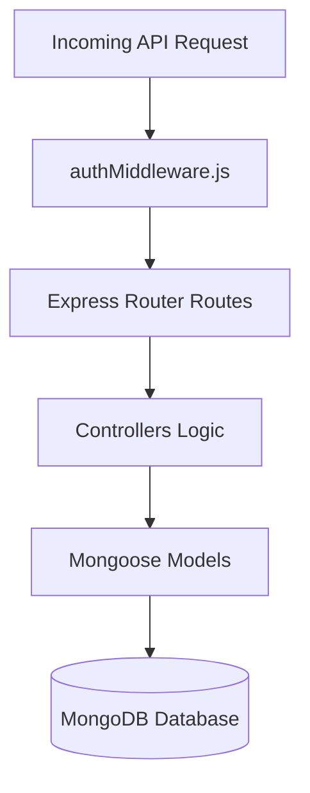
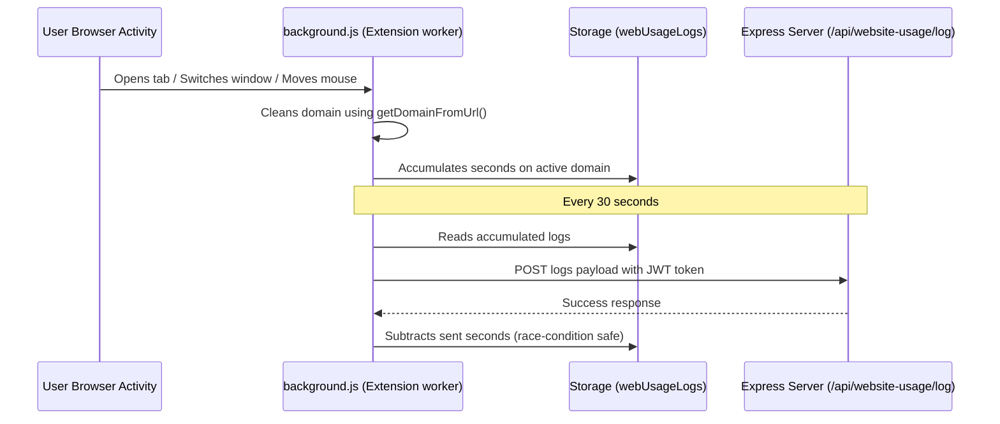
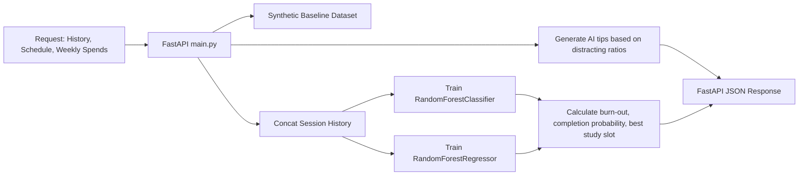
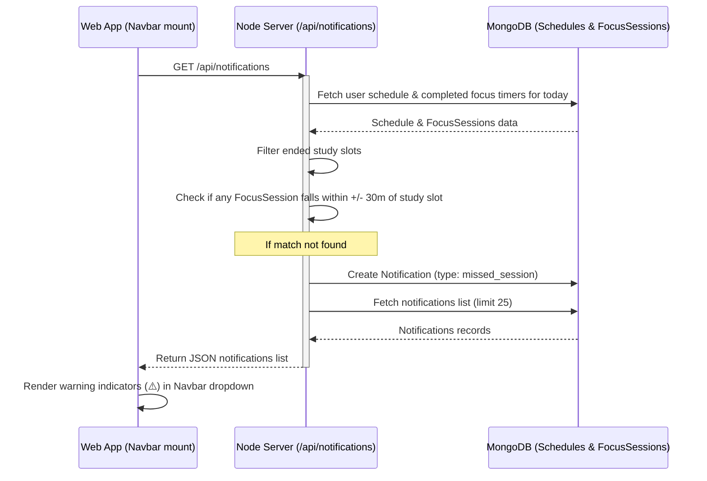
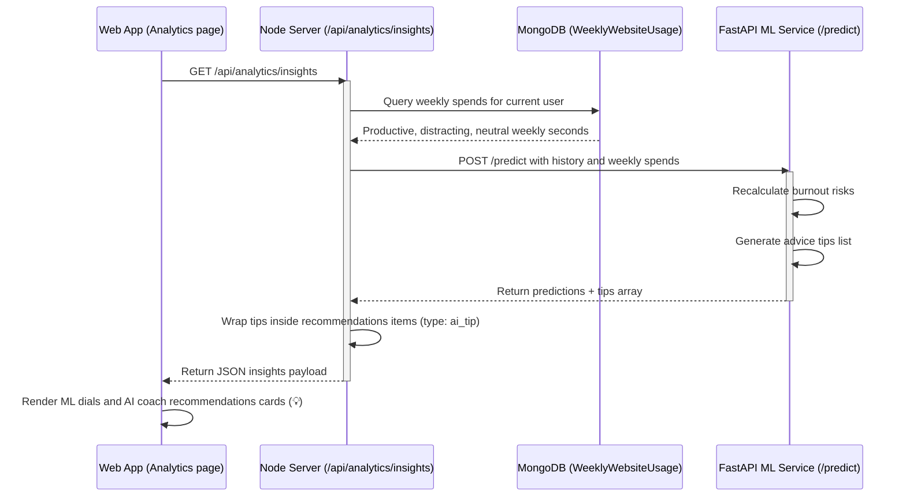

# FocusFlow Architecture & Codebase Guide (`UNDERSTAND.md`)

This guide explains how FocusFlow's files are structured, what each file is responsible for, and how the Chrome Extension, FastAPI ML service, Node.js Backend, and React Frontend connect end-to-end.

---

## 1. Directory Blueprint

```
FocusFlow/
├── client/          # Frontend Web Application (React + Vite)
├── server/          # Backend API Gateway & Database Controller (Node.js + Express + Mongoose)
├── extension/       # Browser Enforcer & Tracking Layer (Chrome Extension Manifest V3)
└── ml-service/      # AI Analytics & Prediction Engine (FastAPI + Scikit-Learn)
```

---

## 2. Server Architecture (`server/`)

The backend functions as the centralized API gateway, user authentication database, and notification engine.



### 2.1 Mongoose Models (`server/models/`)
These files define how data is structured and stored inside MongoDB:
*   [User.js](file:///d:/Personal/FocusFlow/server/models/User.js): Stores user credentials (name, email, hashed password) and preferences (timezone, theme appearance settings).
*   [UserProfile.js](file:///d:/Personal/FocusFlow/server/models/UserProfile.js): Stores detailed student profile data gathered during onboarding (academic level, stream, target goals, preferred study style, wake/sleep schedules).
*   [Schedule.js](file:///d:/Personal/FocusFlow/server/models/Schedule.js): Stores the weekly 7-day study timetable. Each day contains an array of events (sleep, class, study, commute, leisure).
*   [FocusSession.js](file:///d:/Personal/FocusFlow/server/models/FocusSession.js): Stores historical study timers including session duration, completion status, distraction count, pause count, ratings, and qualitative difficulty feedback.
*   [Notification.js](file:///d:/Personal/FocusFlow/server/models/Notification.js): Stores real-time alerts generated for the user (missed session warnings and dynamic AI tips).
*   [WebsiteUsage.js](file:///d:/Personal/FocusFlow/server/models/WebsiteUsage.js): Logs daily domain active seconds (categorized as Productive, Neutral, or Distracting).
*   [WeeklyWebsiteUsage.js](file:///d:/Personal/FocusFlow/server/models/WeeklyWebsiteUsage.js): Stores weekly aggregated domain spends, indexed by the Monday of the current week (`weekStartDate`).
*   [MonthlyWebsiteUsage.js](file:///d:/Personal/FocusFlow/server/models/MonthlyWebsiteUsage.js): Stores monthly aggregated domain spends, indexed by the 1st of the month (`monthStartDate`).

### 2.2 Controllers (`server/controllers/`)
These process request payloads and run the core backend logic:
*   [authController.js](file:///d:/Personal/FocusFlow/server/controllers/authController.js): Manages secure registration, password hashing using `bcryptjs`, and issuing JWT tokens containing user IDs.
*   [userProfileController.js](file:///d:/Personal/FocusFlow/server/controllers/userProfileController.js): Handles retrieval, completion checks, and profile adjustments during the onboarding wizard.
*   [scheduleController.js](file:///d:/Personal/FocusFlow/server/controllers/scheduleController.js): Implements the baseline generator algorithm. It reads onboarding details and places sleep blocks, class timings, commute buffers, and study sessions into a clean weekly calendar.
*   [focusController.js](file:///d:/Personal/FocusFlow/server/controllers/focusController.js): Logs focus timer completions and saves post-session feedback.
*   [websiteUsageController.js](file:///d:/Personal/FocusFlow/server/controllers/websiteUsageController.js): Processes domain logs sent by the Chrome extension. It classifies URLs dynamically (e.g. `leetcode.com` as productive, `youtube.com` as distracting) and upserts them into daily, weekly, and monthly tables.
*   [notificationController.js](file:///d:/Personal/FocusFlow/server/controllers/notificationController.js): Runs dynamic schedule checks. If a study block has ended and no focus session was logged within `+/- 30 mins`, it creates a `missed_session` notification.
*   [analyticsController.js](file:///d:/Personal/FocusFlow/server/controllers/analyticsController.js): Aggregates focus hours and website statistics, queries the Python ML microservice, and maps prediction parameters (burnout risk, AI tips) to the client.

### 2.3 Middleware (`server/middleware/`)
*   [authMiddleware.js](file:///d:/Personal/FocusFlow/server/middleware/authMiddleware.js): Intercepts protected requests, decodes the HTTP Authorization header (`Bearer <JWT-token>`), verifies the JWT signature, and appends the user details to the request object (`req.user`).

---

## 3. Chrome Extension Companion (`extension/`)

The extension functions as the telemetry tracking device and focus block enforcer.



### 3.1 Core Scripts
*   [manifest.json](file:///d:/Personal/FocusFlow/extension/manifest.json): Configuration file declaring permissions (`storage` to save credentials, `tabs` to inspect hostnames, `idle` to detect lockouts, `alarms` for timers) and sets `background.js` as the background Service Worker.
*   [background.js](file:///d:/Personal/FocusFlow/extension/background.js): 
    *   **Telemetry Tracker:** Listens to `tabs.onActivated`, `tabs.onUpdated`, `windows.onFocusChanged`, and `idle.onStateChanged`. Calculates duration and increments domain logs inside local storage.
    *   **Enforcer Blocker:** During focus sessions, it scans opened hostnames. If a tab matches the blocklist, it updates the tab URL directly to `block.html`.
    *   **Log Sync Engine:** Runs `setInterval` to flush local logs to the Node server every 30 seconds.
*   [popup.html](file:///d:/Personal/FocusFlow/extension/popup.html) & [popup.js](file:///d:/Personal/FocusFlow/extension/popup.js): The extension dropdown layout. Authenticates users, reads dashboard state, and communicates commands (`START_FOCUS`, `STOP_FOCUS`, `FORCE_SYNC`) to the service worker.
*   [block.html](file:///d:/Personal/FocusFlow/extension/block.html): The redirect landing page shown when accessing blocked distracting domains during study sessions.

---

## 4. Machine Learning Service (`ml-service/`)

FocusFlow uses real machine learning to generate personalized predictions and tips.



### 4.1 Prediction & Inference
*   [main.py](file:///d:/Personal/FocusFlow/ml-service/main.py):
    *   **FastAPI endpoints:** Exposes `/predict` to process profile configurations and weekly website usage metrics.
    *   **Cold-Start Dataset:** Dynamically constructs 300 baseline user samples containing study timings, distractions, and completion results.
    *   **Model Training:** Combines synthetic baseline samples with the user's actual historical study records. It trains a `RandomForestClassifier` (predicting session completion probability) and a `RandomForestRegressor` (predicting burnout risk) on the fly.
    *   **Tips Engine:** Evaluates distraction ratios (distracting minutes vs productive minutes) and energy levels to return custom advice strings (e.g. recommending blocklists or shorter timer sessions).

---

## 5. End-to-End Visual Lifecycles

### 5.1 Dynamic Missed Session Alerts


### 5.2 Analytics & AI Coach Tips Compilation

