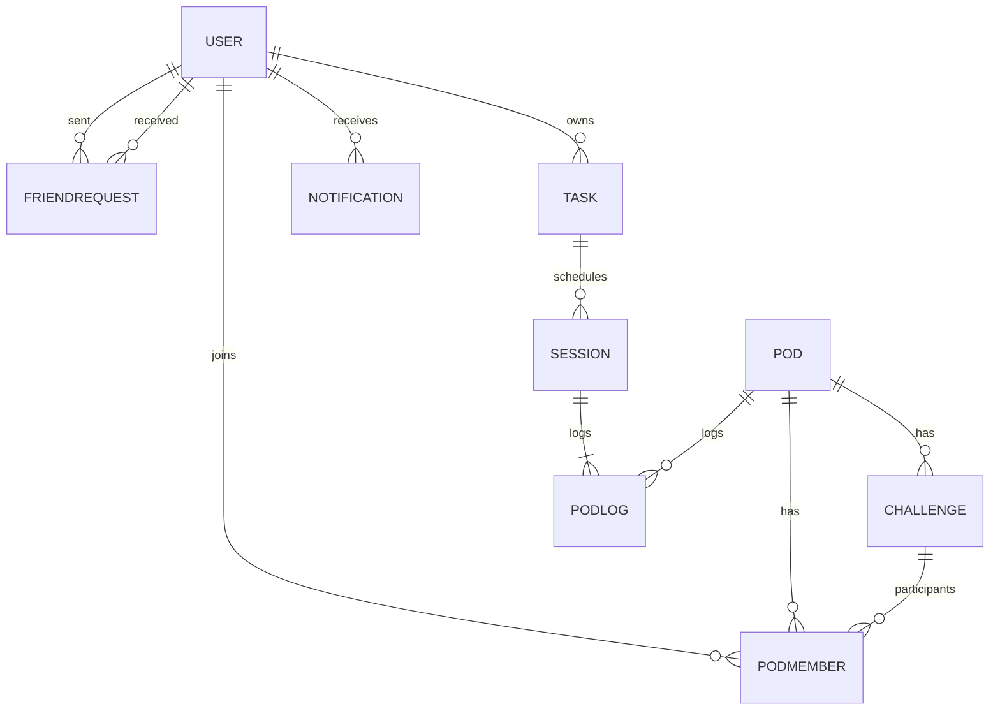
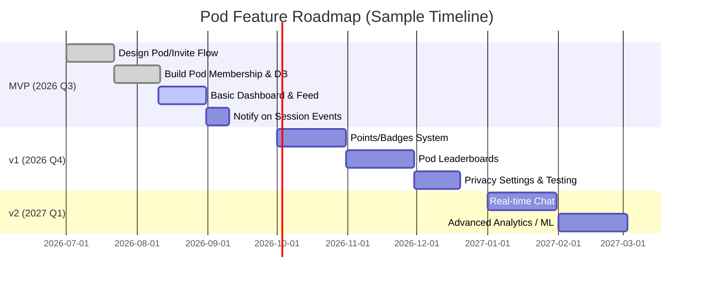

# FocusFlow Social Pods – Feature Design & Implementation

**Executive Summary:** We propose adding a **“Pod” feature** to FocusFlow that lets 3–4 friends connect in small groups for mutual accountability and motivation. Pods blend friendly competition, shared goals, and peer support without adding burn-out. Key ideas include *opt‑in social sharing*, *points/badges/streaks*, gentle *nudges*, and *leaderboards/challenges*. Every missed or completed session can trigger a pod notification (e.g. “Alice just crushed her math session 🎉”). Privacy is protected by **explicit consent** for sharing tasks. We present user stories, compare mechanics (competition vs cooperation vs one‐on‐one accountability), and sketch reward systems with anti-cheat safeguards. We also detail UX flows (invite screens, notifications), a data model (with a mermaid ER diagram), API schemas, wireframe examples (see figures), and a phased roadmap (with timeline). Metrics like DAU/MAU, task completion rates, retention, and pod survival will measure success.

---

## 1. Feature Goals & User Stories

- **Goals:** Boost engagement by adding social hooks; increase productivity by peer support; sustain long-term retention by making scheduling fun.  
- **Primary Users:** Small friend groups (3–4) who want accountability. They already use FocusFlow for personal scheduling, but want a supportive circle.  
- **User Stories:**  
  - *As a user*, I want to **invite friends** into a FocusFlow Pod so we can keep each other on track.  
  - *As a Pod member*, I want to see my friends’ progress (e.g. task completions, streaks) and get notified when they hit milestones or miss sessions.  
  - *As a Pod member*, I want **low-friction interactions** (one-tap invites, friend codes) and fun rewards (points, badges).  
  - *As a user*, I control my privacy: I choose which tasks or stats to share with my Pod.  
  - *As a user who misses a session*, I want a gentle prompt (“How important was this to you?”) and, if needed, encouragement from my pod mates.  

These align with known benefits of social accountability – e.g. Habitica’s parties “offer community support and greater accountability”, and Duolingo’s Friends Quests pair users weekly to cheer each other on. 

---

## 2. Social Mechanics

We compare three approaches:

- **Competition:** (Leaderboards, point races) – e.g. *Strava*-style weekly leaderboards, Duolingo leagues. Drives motivation for some, but can demotivate low scorers. It works best if peers are fairly matched.  
- **Cooperation:** (Group challenges, shared goals) – e.g. Duolingo Friends Quests, Habitica quests. Everyone works toward a common target, which fosters bonding. However, if one person lags, the group may falter (“Groups dissolve after first failure”), so we balance with individual credit.  
- **Accountability (Buddy System):** (One-on-one check-ins) – e.g. Focusmate-style pairing. A tight duo or triad can deeply encourage each other but may lack variety. In FocusFlow, pods mix both: members are all equal, but group culture encourages accountability (like “we all shared our goals today, let’s keep the streak”).

**Comparison Table – Social Mechanics:**

| **Mechanic**      | **Examples**            | **Pros**                                | **Cons/Pitfalls**               |
|-------------------|-------------------------|-----------------------------------------|---------------------------------|
| Competition       | Leaderboards (Strava), contests | Fun rivalry; clear performance goals; many are motivated by rank or prizes | Demotivates those far behind; risk of toxic rivalry or gaming system |
| Cooperation       | Group Quests (Duolingo), shared challenges | Builds team spirit; peer encouragement; shared celebration of wins | Can suffer “social loafing” in groups; if one misses, group may lose momentum |
| Accountability    | Buddy pairs (Focusmate), Accountability groups | Personalized support; someone always reminds you; social pressure to follow through | Limited scale (max 4); mismatched commitment levels can strain trust |

*Insight:* To avoid negatives of “social loafing”, pods will maintain **visibility of individual contribution**. Each member’s tasks and progress are identifiable, so no one can hide. We also combine mechanics: pods can earn a **“Pod Streak”** bonus if all members complete their daily tasks, blending competition (individual points) with cooperation (shared streak bonus).

---

## 3. Reward Systems & Anti-Gaming

FocusFlow pods use layered rewards:

- **Points & Experience:** Each completed task or session yields XP/points. Example: Finish a 1-hour task = 10 XP. Pods can show total XP per member and a small group XP bar for joint challenges. (Similar to Habitica’s RPG XP for tasks.)  
- **Badges/Achievements:** Milestones unlock badges (e.g. “First Pod Session”, “5-Day Pod Streak”, “Study Guru” for high total focus time).  
- **Streaks:** Personal daily task streaks, and **Pod Streak** if the entire group hits all tasks for a day. Maintaining a streak unlocks visual flair or bonus points.  
- **Leaderboards:** Weekly/Monthly leaderboard within each Pod (showing who did most work). To avoid unfairness, leaderboards restart weekly and rank by relative completion or points earned.  
- **Micro-Rewards:** Earn small in-app rewards (e.g. confetti animations, positive “kudos” messages or GIFs shared in chat) when major milestones hit. Duolingo-style “nudges” are built-in – e.g. send a preset “Great job! 🎉” message or a bonus XP “gift” to a friend.  

**Anti-Gaming Safeguards:** To prevent trivial task spam or cheating:  
- **Weighted Scoring:** Harder or longer tasks award proportionally more points.  
- **Progress Verification:** Optionally require photo/upload proof or short notes for completed tasks (e.g. screenshot of finished homework).  
- **Cap Daily Points:** Maximum points per day (e.g. you can’t earn >50 XP in 10 minutes).  
- **Peer Accountability:** Pod members can “thumbs up” or comment on each other’s sessions, providing social oversight.  
- **Audit Rare Events:** If unusual patterns occur (e.g. one person suddenly racks up massive XP), trigger a review or temporary lock.  

**Comparison Table – Reward Types (and Trade-Offs):**

| **Type**        | **Function**                              | **Pros**                        | **Cons/Gamification Risk**            |
|-----------------|-------------------------------------------|---------------------------------|--------------------------------------|
| Points/XP       | Quantify effort & progress               | Simple numeric feedback; aligns with tasks | Users might farm many tiny tasks for points |
| Badges/Achievements | Milestone markers (level-ups, trophies) | Motivational goals; prestige   | Could feel trivial if earned too easily |
| Streaks         | Consecutive-day targets (personal, group) | Creates habit; fear-of-breaking streak motivates consistency | Encourages logging false completions to maintain streak |
| Leaderboard     | Rank users by points or completions | Sparks competition; status     | May demotivate lower ranks; can be gamed if imbalance |
| Group Challenges| Shared quests (e.g. all finish one task type) | Team building; shared reward  | “One failure sinks all” risk unless designed carefully |
| Micro-Rewards   | Immediate positive feedback (animations, GIFs) | Instantly gratifying; variety | Must not become spammy; risk of habituation if overused |

Each reward type will be implemented with checks (as above) and an **anti-gaming clause** stating users must not exploit any bug to inflate scores. We’ll monitor for patterns of abuse (e.g. many tasks canceled) and take action (warnings or resets).

---

## 4. Privacy & Consent

**Control & Transparency:** Users must explicitly **opt in** to any social sharing. Pods are always invite-only (similar to Strava clubs requiring mutual follow or a direct invite link). 

- **Data Shared:** By default, a Pod sees **task names and completion status**, plus aggregate scores. We allow *granular control*: users can mark certain tasks as “private” (like personal chores) that never appear in the Pod’s feed. Only general progress (points gained or “Task Completed” events) is shown for those.  
- **Consent Flow:**  
  1. **Invite:** When someone invites you, FocusFlow shows a prompt “Alice invites you to join Pod *Math Champs*. Accept?” with info on what will be shared.  
  2. **Settings:** Users can go to **Settings > Privacy** to toggle which task categories or goals to share with pods. For example, *“Share study tasks ✓, share personal to-dos ✗.”*  
  3. **Visibility Options:** We could offer *Friends-Only* (only accepted pod members see my data), *Pod Summary Only* (show only stats like “Alice earned 50 XP today”), or *Private* (no sharing). Each trade-off is made clear.  

**Privacy-Tradeoff Table:**

| **Privacy Setting**    | **Data Visible to Pod**              | **Benefit**                                   | **Risk**                               |
|------------------------|--------------------------------------|-----------------------------------------------|----------------------------------------|
| Public to Pod (opt-in) | Task names + completion + points      | Full accountability and encouragement         | Less personal privacy (e.g. friends know exactly what you did) |
| Aggregate-Only         | Only points or badges earned          | Maintains privacy of task details             | Less context for friends to encourage/talk about tasks |
| None (Private)         | Nothing shared                        | Maximum privacy                              | No social accountability or praise    |

By analogy, Strava lets you choose who sees activities; we’ll do likewise. *Privacy statements* in the UI will reassure users (e.g. “Your FocusFlow tasks remain yours; friends only see what you allow.”).

---

## 5. UX & Invitation Flows

**Low-Friction Friend Invites:** We adopt familiar patterns:
- **Invite Methods:** Users can invite by *username/email*, or by sharing a unique Pod link. (Habitica lets players share username/email to form parties.) The invite modal is accessible from the Pod page.  
- **Mutual Acceptance:** Both parties must accept an invite (Strava’s club requires mutual follow). We’ll implement a *FriendRequest* or *PodInvite* table with status = Pending/Accepted.  

**UX Example – Invite Screen:** (see Figure below)  
 *Figure: Example “Pending Invitation” screen. When someone invites you to a pod, FocusFlow shows a friendly dialog (e.g. “Alex Stone wants to join your Study Buddies! 5 mutual tasks”). Buttons might say “Confirm” or “Delete Request.”*  
This pattern (inspired by Habitica/Discord friend invites) immediately tells users who and why. The microcopy could be:  
- *Title:* “Join Study Pod?”  
- *Body:* “Alex Stone would like to join your Pod. You have 5 common tasks.”  
- *Actions:* [ **Confirm** ] [ **Decline** ]  

**Pod Dashboard & Notifications:** Once in a pod, users see a simple feed or dashboard:
- *Activity Feed:* A scrollable list like:
  > *Alice completed “Write Essay” (30m)*  
  > *Bob earned 20 XP for “Solving Math problems”*  
  > *“Carol is on a 4-day streak!”*  

- *UI Wireframes:* (example below) Possibly multi-pane on web, or swipe-able cards on mobile.  

 *Figure: Sample wireframe flow (onboarding + pod screen). A user can onboard (top), invite friends to a pod (middle), and view a pod dashboard (bottom) showing members and progress.*  
The example shows screens like “Add Friends to Pod” (checkboxes) and “Pod Summary” (“Great job! Everyone finished their tasks!”). FocusFlow’s actual copy might be: “Invite your study buddies to Form a Pod” or “Great job on completing your session!” depending on context. We would use a friendly, motivating tone.

**Session-Level Triggers:** Based on user actions:  
- **On Complete:** Immediately notify (push or in-app) other pod members: “Alice just completed **DSA practice** 🎉”. This leverages the idea from a user request: *“every time I log +1 hour… he receives a push notification…”*.  
- **On Miss:** If a user skips a scheduled session, FocusFlow first shows the importance prompt (“Was this session Critical/Important/Optional?”). If marked *Critical/Important*, the system can optionally notify others: e.g. “Bob missed his Math session – send some encouragement?” with pre-written nudge texts (“You got this tomorrow!”).  
- **On Recover:** If a missed session is rescheduled and completed later, announce “Bob made up his *Missed Math* session – well done 💪”. 

**Notification Cadence:**  
- Real-time for critical events (task done, session start).
- Daily summary digest (6pm): “Today your Pod completed 8 tasks; Alice earned 50XP, Bob 40XP” – to avoid constant pings.  
- Escalation: If a user misses three sessions in a row, send an “Are you okay?” push or email, then maybe alert pod leader (if designated).  

Microcopy examples: “+3 XP!” after a session, “Don’t give up, you can do it!” as a nudge, etc.

---

## 6. Data Model & API

### Data Entities (ER Diagram):



- **USER:** existing (FocusFlow users).  
- **POD:** (id, name, description, createdAt, leaderId, status).  
- **PODMEMBER:** join table (userId, podId, role, joinedAt).  
- **FRIENDREQUEST:** (id, fromUserId, toUserId, status="pending/accepted", sentAt).  
- **TASK/SESSION:** existing (scheduled tasks), plus new *PODLOG* for recording each session event in the context of a Pod (sessionId, podId, userId, status).  
- **NOTIFICATION:** (id, userId, type, payload, readAt).  

### Example API Endpoints (JSON flows):

- **Create Pod:** `POST /api/pods`  
  _Request:_ `{ "name": "Math Champs", "memberIds": [2,5,7] }`  
  _Response:_ `{ "podId": 123, "name": "Math Champs", "members": [ ... ] }`

- **Invite Friend:** `POST /api/pods/{podId}/invite`  
  _Request:_ `{ "toUserId": 8 }`  
  _Response:_ `{ "invitationId": 456, "status": "pending" }`

- **Accept Invite:** `POST /api/pods/invitations/456/respond`  
  _Request:_ `{ "accept": true }`  
  _Response:_ `{ "podId": 123, "message": "Welcome to Math Champs!" }`

- **Get Pod Dashboard:** `GET /api/pods/{podId}`  
  _Response:_  
  ```json
  {
    "podId": 123,
    "name": "Math Champs",
    "members": [
      {"userId": 1, "name": "Alice", "todayXP": 30},
      {"userId": 2, "name": "Bob", "todayXP": 25}
    ],
    "activityFeed": [
      {"time": "09:00", "message": "Alice completed 'Chapter 5 Reading' (45m)"},
      {"time": "10:30", "message": "Bob earned 25 XP for 'Practice Quiz'"}
    ]
  }
  ```
- **Session Completion:** `POST /api/sessions/{sessionId}/complete`  
  _Request:_ `{ "sessionId": 789, "status": "completed" }`  
  _Response:_ `{ "success": true }`  
  *This triggers server logic to create a notification to the Pod members.*

- **Leaderboard:** `GET /api/pods/{podId}/leaderboard`  
  _Response:_ a ranked list by XP or tasks completed this week.

- **Metrics:** `GET /api/metrics/pod-engagement` etc. (to feed admin dashboards).  

All JSON is illustrative; actual fields can be extended (e.g. include timestamps). Unspecified details (auth tokens, error codes) are left as recommendations.

---

## 7. Session Triggers & Notifications

To maximize accountability, FocusFlow emits in-app and push notifications tied to session events:

- **On Task Completion:** Notify pod members (if they opted in). E.g. “Carol just completed *Physics Homework*! 🎉”. This realtime feedback boosts motivation (as requested in user forums).  
- **On Task Missed:** Internally, trigger the missed-session flow: ask user importance, possibly reschedule. Optionally, the user can share “Oops, I missed!” so others can encourage.  
- **On Task Recovered:** “Carol made up yesterday’s Physics session – great perseverance!” (reinforces positive behavior).  
- **Weekly Summary:** “This week, your Pod completed 15 tasks with an average score of 80%”.  

Notifications respect each user’s chosen cadence (immediate vs digest) and snooze settings. An example escalation: If someone is inactive for 3 days, send a gentle prompt; if 7+ days, suggest verifying well-being or pausing the pod (to avoid abandonment).

---

## 8. Metrics Dashboard

We track **engagement, retention, productivity lift, and social metrics**:

- **Engagement:** DAU/WAU/MAU for pods (how many active pod sessions per user); average daily sessions per user; number of pod invites accepted.  
- **Retention:** Cohort retention of users with pods vs those without (e.g. one-month retention). Pod-churn (how many pods are abandoned).  
- **Productivity Lift:** Self-reported + actual outcomes. Focusmate reported users felt 143% productivity boost – we can survey FocusFlow pod users similarly. Quantitative: tasks completed vs scheduled.  
- **Social Churn:** Number of pods ended, average pod lifespan, friends removed.  
- **Other:** Group streaks achieved, number of nudges sent.  

Dashboard charts might include: time-series of weekly active pods, a bar chart of average tasks per user with and without pods, funnel of invites→joins→active pods, and a satisfaction survey gauge. (As an example, Focusmate’s stats show 77% felt more connected – a goal metric could be increasing users’ sense of support via surveys.)

---

## 9. Sample UI (Wireframes & Microcopy)

Below are conceptual sketches (wireframes) of key screens:

 *Figure: “Pending Invitation” mobile UI.* When a friend invites you to a pod, the app shows a pending invite card. Example microcopy: “**John Doe** wants to join your *Daily Study Pod*. You have 3 common friends.” Buttons: **Confirm** (joins pod) or **Decline**. (Colors/text as shown.)  

 *Figure: Example multi-screen flow.*  (Top) Onboarding/Pod creation screen (“Create a Pod – Invite Friends”). (Middle) Friend selection list (“Add members to **Math Champs**”). (Bottom) Pod dashboard (“Pod Members” and “Today’s Progress”). Microcopy snippets: “Invite your study buddies 👋”, “Outstanding! Everyone completed their tasks today! 🚀”. The style is clean and friendly, guiding users step-by-step.

Each screen uses friendly, brief text. For example:
- **Invite Screen:** Title: “Join Pod?”, Body: “Alice says she’ll help keep you on track. Accept her invite?” Buttons: “Accept” / “Ignore”.  
- **Pod Dashboard:** Header “Math Champs – Day 3”, sections “Member XP” and “Group Streak”. Encouraging tooltips like “Keep it up!” or “Time for a break?”.

These mockups are illustrative; final UI would align with FocusFlow’s branding. The key is clarity: large buttons, concise labels, and consistent icons.

---

## 10. Moderation & Abuse Prevention

Though pods are small and private, we plan basic safeguards:
- **User Controls:** Any member can *leave* a pod. Pod owners (leaders) can remove inactive or abusive members.  
- **Reporting:** Provide a way to report harassment or spammy behavior. Given the closed small-group nature, this will be light-touch.  
- **Content Filters:** (If we allow free-text chat or comments) moderate profanity or hateful speech.  
- **Rate Limits:** Prevent bots/spam in any chat or notification features.  

Privacy rules (opt-in) also mean no unwanted shares. We’ll publish Community Guidelines: “Be supportive, not judgmental.” Abuse is unlikely in 3–4 person study pods, but the option to mute or exit a pod will be available.

---

## 11. A/B Testing & Success Criteria

We recommend experiments to fine-tune features:

- **Pod vs Solo:** Offer social features to a test group and compare retention/engagement vs control. *Success:* +% increase in 30-day retention or weekly active users.  
- **Competition vs No-Leaderboard:** Randomly assign pods that see a leaderboard vs pods without it. Measure which group does more tasks or reports higher motivation. *Success:* If leaderboards boost task completion by X%.  
- **Rewards Tuning:** Test point values or badge thresholds (e.g. small XP per task vs big milestones). Track usage, satisfaction surveys. *Success:* Higher engagement or self-reported fun.  
- **Notification Frequency:** Try immediate vs batched notifications. Measure uninstalls or do-not-disturb rates. *Success:* Find balance with minimal notification churn.  

**Key metrics:** increase in tasks completed per user, Pod activation rate, average sessions per week, survey “felt more motivated” scores. Ideally, social pods should yield a statistically significant productivity lift (similar to Focusmate’s +143% reported gain) and higher retention.

---

## 12. Technical Considerations

- **Backend Impact:** Requires new tables/APIs (Pods, invites, notifications), realtime service for push or websockets. If FocusFlow backend is Node/Express (as likely), add Pod controllers.  
- **Frontend:** New screens (Pod list, invite flow, activity feed). Use existing UI framework (React). Ensure notification UI and chat (if any).  
- **Push Notifications:** Likely integrate with mobile push (FCM/APNs). Could reuse or extend current notification service.  
- **Data Privacy:** Make sure pods observe GDPR/CCPA rules (users can delete their data/share).  
- **Complexity:** Moderate. Core scheduler exists; adding social layer is significant but manageable. MVP (pod logic, invites) ~3–4 weeks of dev + testing. v1 (rewards, leaderboards) ~4–6 weeks. v2 (chat, analytics) additional ~4 weeks.  

**Tech Stack:** (Assuming) React (web/mobile), Node/Express API, Mongo/Postgres DB, JWT auth, push service. Possibly a small recommendation engine or ML layer later (for suggesting friends or challenges).

---

## 13. Roadmap

**MVP (Q3 2026):** 
- Design & implement Pod creation and invite flow.  
- Basic Pod dashboard: member list and task-completion feed.  
- Missed-session dialog integrated with Pod (importance prompt).  
- Notifications for session complete/miss.  

**v1 (Q4 2026):** 
- Gamification layer: points/XP, badges, streaks.  
- Leaderboard and simple group challenges (e.g. “all finish at least 3 tasks today”).  
- Privacy controls: task-sharing settings.  
- Initial metrics tracking and A/B test framework.  

**v2 (Q1 2027):** 
- Real-time chat/comments within pods.  
- Advanced analytics (visual dashboards, improvement reports per pod).  
- Expanded social features (pod recommendations, cross-pod contests).  
- Integrate any Machine Learning (e.g. Smart challenge suggestions).



This phased plan ensures a lean MVP with core functionality, then iterative enhancements. At each stage we’ll measure adoption and iterate based on A/B tests (e.g. adjusting point values or invite UI placements).

---

All design elements above draw from proven patterns: **Habitica parties for group accountability**, **Strava clubs and leaderboards for friendly competition**, and **Duolingo’s social quests for cooperative challenges**. By carefully combining competition, cooperation, and individual accountability—and giving users control over privacy—FocusFlow’s pod feature can make productivity social and sustainable without feeling like a chore. 

**Sources:** Concepts and examples are based on best practices from social productivity apps (Habitica, Strava, Duolingo) and gamification research. The above plan incorporates those insights into an implementable social feature for FocusFlow.